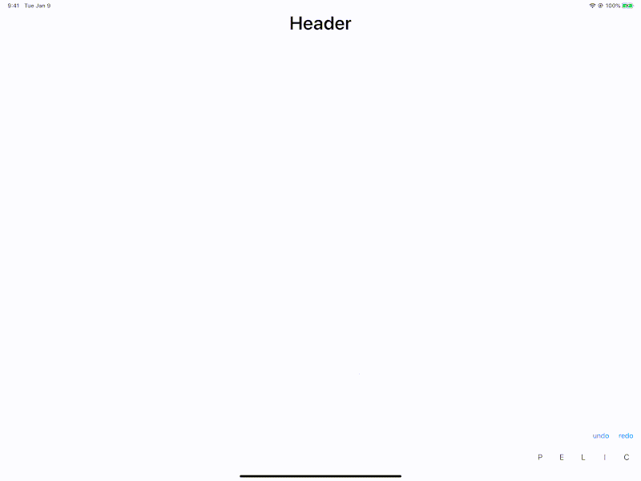

# DrawingKit

Can be used as a backport of PencilKit.

## Drawing tools
- [x] Pencil
- [x] Eraser
- [x] Lasso - can move line and image.
- [ ] etc..

* eraser haven't been perfect yet.

## Other tools
- [x] Frame
- [x] Header
- [x] Background image 
- [ ] etc..
